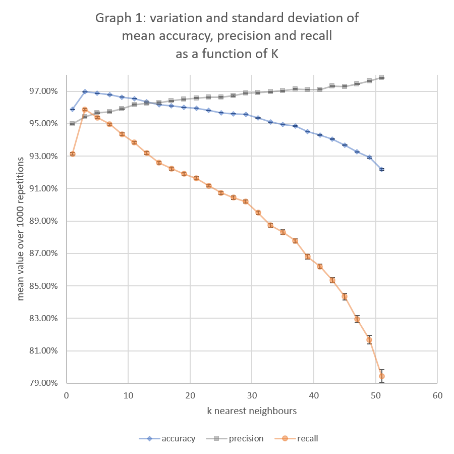

# K nearest neighbours
## 360-420-DW, Section 2
## Elizabeth Barnes

## Distributions of Model Accuracy

Lines 148-150 of `DataSet.java` call on the shuffle method, 
which rearranges the order of the DataPoints, 
so each time a different 30% of the data is reserved for the test group. 
Since the classifier is working with different training and test data each time, 
the predictions and results will change too.	

Line 200 of `DataSet.java` defines a method which looks at the labels of every data point passed into it.
The entire breast cancer data set contains 444 malignant data points and 237 benign data points;
however, due to the shuffle method, it is impossible to know what portion of the data will end up in the testing group or the training group.

The training data set will contain 476 elements when 30% of the total data is set aside for testing.
Since k must be odd to avoid a tie in the labels of the nearest neighbours, the highest k would have a value of 475, 
which would generate a prediction based on nearly every element of the training set; 
however, the maximum value that k can reach before causing a null pointer exception is 51.

The most simple baseline to compare the model to would be using a k value of 1, so that it only looks for the most simmilar point, 
wihtout analyzing the other ones nearby to come up with a potentially better guess.
As shown in Graph 1, this gives an average accuracy of `95.81% ± 0.01`.
Graph 1 also shows that the accuracy of the prediction is maximized when `k = 3`.

## Analysis of different error types

In the case of the breast cancer data set, there are two possible mistakes that the cassifier can make.
<ul>
	<li>false positive: giving the prediction of "malignant" to a tumor that is actually benign </li>
	<li>false negative: giving the prediction of "benign" to a tumor that is actually malignant </li>
</ul>
Precision compares the number of correct malignant predictions to the total number of malignant predictions.
The baseline precision value when `k = 1` is `94.85% ± 0.05`. 
It improves as k increases, as seen in Graph 1.

Recall compares the number of correct malignant predictions to the total number of malignant cases.
The baseline recall value when `k = 1` is `93.06% ± 0.10`.
As seen in Graph 1, it has a maximal value when `k = 3` and decreases as k increases past 3.

```java
accuracy[r] = (correct/testData.size());
precision[r] = (malignantMalignant/predictedMalignant);
recall[r] =  (malignantMalignant/actuallyMalignant);
```
It is possible to have the precision and recall equal 1 individually by simplifying the model.

If the classifier were to ignore the data and predict that every single tumor was malignant, 
then the recall would reach 100%, since all of the malignant tumors would have been labeled correctly, 
and there would not have been any incorrectly labeled malignant cases.
Unfortunately, this leads to an accuracy and precision of about 35%
```java
for(i = 0; i<testData.size(); i++){
	prediction = "malignant";
	answer = testData.get(i).getLabel();
}
```
If instead, the classifier guessed that all tumors were benign, except for the first one of the first repetition, 
then the precision would reach 100% _only if_ the malignant prediction was correct, since there only needs to be 
one correctly labeled malignant and no incorrectly labeled benign cases.
Unfortunately, this leads to an accuracy of about 60% and a precision of about 1% 
in the case where the 1<sup>st</sup> test point actually corresponds to a malignant tumor, 
which occurs randomly.
```java
for(i = 0; i<testData.size(); i++){
	if(i == 0 && repetition == 0){	
		prediction = "malignant";
	}else{
		prediction = "benign";
	}
	answer = testData.get(i).getLabel();
}
```
In both of these scenarios, there are many incorrect guesses, which causes a low accuracy. 
It is also impossible to follow both rules at once, so the precision and recall can not be maximized together,
The only way to have 100% accuracy, precision and recall all at once 
would be if the classifier were able to perfectly predict each diagnosis. 
Since this is not the case, all three values are affected by the number of neighbours that the precdiction is based on (k).

Creating a random model allows for an accuracy of about 50%, a precision of about 35% and a recall of about 50%, 
which would be one way to increase both precision and recall at the same time, 
without needing to analyze any of the neighbours. This random model is still significantly weaker than 
assigning `k = 1` and only looking at the nearest neighbour, and using `k = 1` is not as good as using `k = 3`.
```java
for(i = 0; i<testData.size(); i++){
	if(Math.random()>0.5){
		prediction = "malignant";
	}else{
		prediction = "benign";
	}
	answer = testData.get(i).getLabel();
}
```

The highest k can be is 51. When this is the case, the accuracy is `92.19% ± 0.05`, 
the precision is `97.83% ± 0.03` and the recall is `79.4% ± 0.4`. 
The model appears to work the best with a k of 3. 
When this is the case, the accuracy is `96.84% ± 0.011`, 
the precision is `95.34% ± 0.05` and the recall is `95.63% ± 0.07`.

## Results

Accuracy, precision and recall were calculated for all odd values of k from 0 to 20 
and printed to the console so that they could be copied into excel to produce the graphs included below.
Based the graphical representation of the data for every possible k, the classifier works optimally when `k = 3`.
```java	
System.out.print(k + ", " + mean(accuracy) + ", " + standardDeviation(accuracy));
System.out.print(", " + mean(precision) + ", " + standardDeviation(precision));
System.out.println(", " + mean(recall) + ", " + standardDeviation(recall));
```



The following table includes the values of the first 10 points represented in the graph:

|k|Mean Accuracy|st.dev. on Accuracy|Mean Precision|st.dev. on Precision|Mean Recall|st. dev. on Recall|
|---|---|---|---|---|---|---|
|1|0.95811|0.00013|0.94847|0.00051|0.93060|0.00098|
|3|0.96839|0.00011|0.95355|0.00050|0.95628|0.00068|
|5|0.96846|0.00012|0.95534|0.00050|0.95403|0.00073|
|7|0.96799|0.00012|0.95697|0.00046|0.95097|0.00067|
|9|0.96604|0.00014|0.95895|0.00046|0.94303|0.00077|
|11|0.96507|0.00014|0.96047|0.00044|0.93817|0.00077|
|13|0.96269|0.00014|0.96207|0.00043|0.92961|0.00084|
|15|0.96224|0.00015|0.96353|0.00039|0.92664|0.00087|
|17|0.96086|0.00014|0.96450|0.00037|0.92195|0.00084|
|19|0.95993|0.00015|0.96551|0.00036|0.91766|0.00092|


