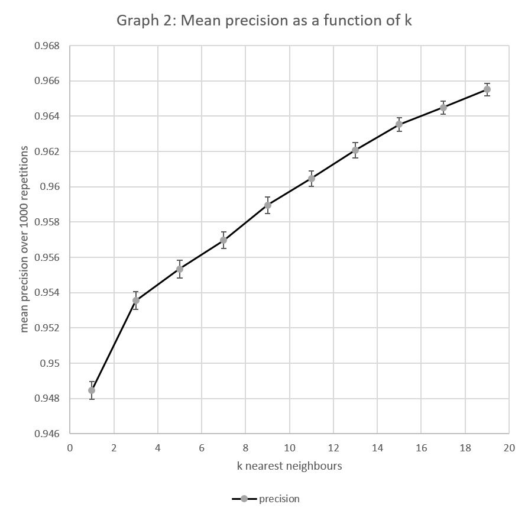

# K nearest neighbours
## 360-420-DW, Section 2
## Elizabeth Barnes

## Distributions of Model Accuracy

Lines 148-150 of `DataSet.java` call on the shuffle method, 
which rearranges the order of the DataPoints, 
so eah time a different 30% of the data is reserved for the test group. 
Since it is working with different training and test data each time, 
the predictions and results will change too.	


Line 200 of `DataSet.java` calls a method to figure out the labels of the most similar data points to the one currently being tested. 
The most simple baseline to compare the model to would be using a k value of 1, so that it only looks for the most simmilar point, 
wihtout analyzing the other ones nearby to come up with a potentially better guess.
As shown in graph 1, this gives an average of `95.81% ± 0.01`.
Graph 1 also shows that the accurasy of the prediction is maximized when `k = 3`.


## Analysis of different error types

In the case of the breast cancer data set, there are two possible mistakes that the cassifier can make.
<ul>
	<li>false positive: giving the prediction of "malignant" to a tumor that is actually benign </li>
	<li>false negative: giving the prediction of "benign" to a tumor that is actually malignant </li>
</ul>


Precision compares the number of correct malignant predictions to the total number of malignant predictions.
The baseline precision value when `k = 1` is `94.85% ± 0.05`. 
It improves as k increases, as seen in graph 2.

Recall compares the number of correct malignant predictions to the total number of malignant cases.
The baseline recall value when `k = 1` is `93.06% ± 0.10`.
As seen in graph 3, it has a maximal value when `k = 3` and decreases as k increases past 3.

```java
	accuracy[r] = (correct/testData.size());
	precision[r] = (malignantMalignant/predictedMalignant);
	recall[r] =  (malignantMalignant/actuallyMalignant);
```


If the classifier were able to perfectly predict each diagnosis, then there would be no difference between the two values,
since they would both be equal to 1. 
The changes in all three analytical measures (accuracy, precision and recall) are affected by the value of k.

## Results

Accuracy, precision and recall were calculated for all odd values of k from 0 to 20 
and printed to the console so that they could be copied into excel to produce the graphs included below.
Based on graphs 1 and 3, the classifier works optimally when `k = 3`.

```java	
	System.out.print(k + ", " + mean(accuracy) + ", " + standardDeviation(accuracy));
	System.out.print(", " + mean(precision) + ", " + standardDeviation(precision));
	System.out.println(", " + mean(recall) + ", " + standardDeviation(recall));
```


The following is the table of values represented in the graphs:

|k|Mean Accuracy|st.dev. on Accuracy|Mean Precision|st.dev. on Precision|Mean Recall|st. dev. on Recall|
|---|---|---|---|---|---|---|
|1|95.811%|0.013%|94.847%|0.051%|93.060%|0.098%|
|3|96.839%|0.011%|95.355%|0.050%|95.628%|0.068%|
|5|96.846%|0.012%|95.534%|0.050%|95.403%|0.073%|
|7|96.799%|0.012%|95.697%|0.046%|95.097%|0.067%|
|9|96.604%|0.014%|95.895%|0.046%|94.303%|0.077%|
|11|96.507%|0.014%|96.047%|0.044%|93.817%|0.077%|
|13|96.269%|0.014%|96.207%|0.043%|92.961%|0.084%|
|15|96.224%|0.015%|96.353%|0.039%|92.664%|0.087%|
|17|96.086%|0.014%|96.450%|0.037%|92.195%|0.084%|
|19|95.993%|0.015%|96.551%|0.036%|91.766%|0.092%|


